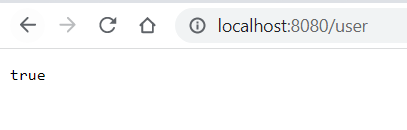
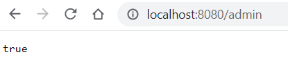
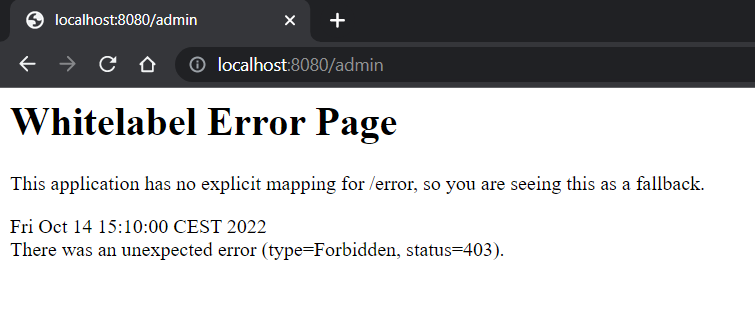

## Ejemplo login basico con spring

### BBDD

Utilizaremos mysql, podemos levantar una instancia en local usando docker con este comando

    docker run -p 3306:3306  --name bael-mysql  -e MYSQL_ROOT_PASSWORD=pass  -e MYSQL_DATABASE=jdbc_authentication  mysql:latest
 
Para el ejemplo creamos 2 tablas y las poblamos
    
    CREATE TABLE users (
                            name VARCHAR(50) NOT NULL,
                            email VARCHAR(50) NOT NULL,
                            password VARCHAR(100) NOT NULL,
                            enabled TINYINT NOT NULL DEFAULT 1,
                            PRIMARY KEY (email)
    );

    CREATE TABLE roles (
    email VARCHAR(50) NOT NULL,
    role VARCHAR(50) NOT NULL,
    FOREIGN KEY (email) REFERENCES users(email)
    );
    
    CREATE UNIQUE INDEX ix_auth_email on roles (email,role);
    
    -- User user@email.pass/pass
    INSERT INTO users (name, email, password, enabled)
    values ('user',
    'user@email.com',
    '$2a$10$8.UnVuG9HHgffUDAlk8qfOuVGkqRzgVymGe07xd00DMxs.AQubh4a',
    1);
    
    INSERT INTO roles (email, role)
    values ('user@email.com', 'ROLE_USER');
    
    INSERT INTO users (name, email, password, enabled)
    values ('admin',
    'admin@email.com',
    '$2a$10$8.UnVuG9HHgffUDAlk8qfOuVGkqRzgVymGe07xd00DMxs.AQubh4a',
    2);
    
    INSERT INTO roles (email, role)
    values ('admin@email.com', 'ROLE_ADMIN');

Para ejecutar la app podemos usar gradle
    
    gralde bootrun

Para probar la app abriremos en el navegador las siguientes url

* http://localhost:8080/user nos devolvera true para los 2 usuarios creados
* http://localhost:8080/admin solo nos devolvera true para el usario admin

